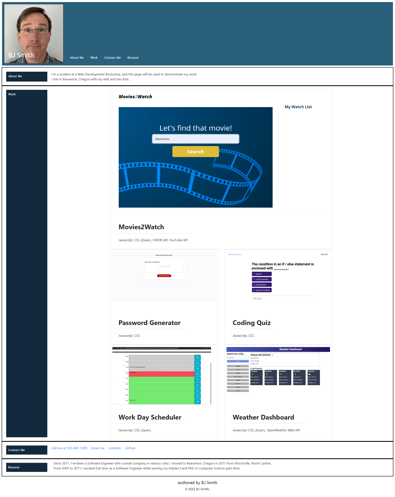

# Module 2 Challenge Webpage

## Description

This portfolio page will showcase my skills and talents to employers looking to fill a part-time or full-time position. An effective portfolio highlights my strongest work as well as the thought processes behind it. Students who have portfolios with deployed web applications (meaning they are live on the web) are typically very successful in their career search after the boot camp. This last point can't be stressed enough: having several deployed projects is a minimum requirement to receive an initial interview at many companies.

With these points in mind, in this Challenge I'll set myself up for future success by applying the core skills I've recently learned: flexbox, media queries, and CSS variables. I'll get to practice my new skills while creating something that I'll use during my job search. It's a win-win that I'll likely be grateful for in the future!

The User Story:

AS AN employer 
I WANT to view a potential employee's deployed portfolio of work samples 
SO THAT I can review samples of their work and assess whether they're a good candidate for an open position 

The Acceptance Criteria:

GIVEN I need to sample a potential employee's previous work 
WHEN I load their portfolio 
THEN I am presented with the developer's name, a recent photo or avatar, and links to sections about them, their work, and how to contact them 
WHEN I click one of the links in the navigation 
THEN the UI scrolls to the corresponding section 
WHEN I click on the link to the section about their work 
THEN the UI scrolls to a section with titled images of the developer's applications 
WHEN I am presented with the developer's first application 
THEN that application's image should be larger in size than the others 
WHEN I click on the images of the applications 
THEN I am taken to that deployed application 
WHEN I resize the page or view the site on various screens and devices 
THEN I am presented with a responsive layout that adapts to my viewport 

## Installation

https://bryanjeremysmith.github.io/Module2Challenge/

## Usage

## Credits

N/A

## License

The MIT License (MIT)
=====================

Copyright © 2022 BJ Smith

Permission is hereby granted, free of charge, to any person
obtaining a copy of this software and associated documentation
files (the “Software”), to deal in the Software without
restriction, including without limitation the rights to use,
copy, modify, merge, publish, distribute, sublicense, and/or sell
copies of the Software, and to permit persons to whom the
Software is furnished to do so, subject to the following
conditions:

The above copyright notice and this permission notice shall be
included in all copies or substantial portions of the Software.

THE SOFTWARE IS PROVIDED “AS IS”, WITHOUT WARRANTY OF ANY KIND,
EXPRESS OR IMPLIED, INCLUDING BUT NOT LIMITED TO THE WARRANTIES
OF MERCHANTABILITY, FITNESS FOR A PARTICULAR PURPOSE AND
NONINFRINGEMENT. IN NO EVENT SHALL THE AUTHORS OR COPYRIGHT
HOLDERS BE LIABLE FOR ANY CLAIM, DAMAGES OR OTHER LIABILITY,
WHETHER IN AN ACTION OF CONTRACT, TORT OR OTHERWISE, ARISING
FROM, OUT OF OR IN CONNECTION WITH THE SOFTWARE OR THE USE OR
OTHER DEALINGS IN THE SOFTWARE.